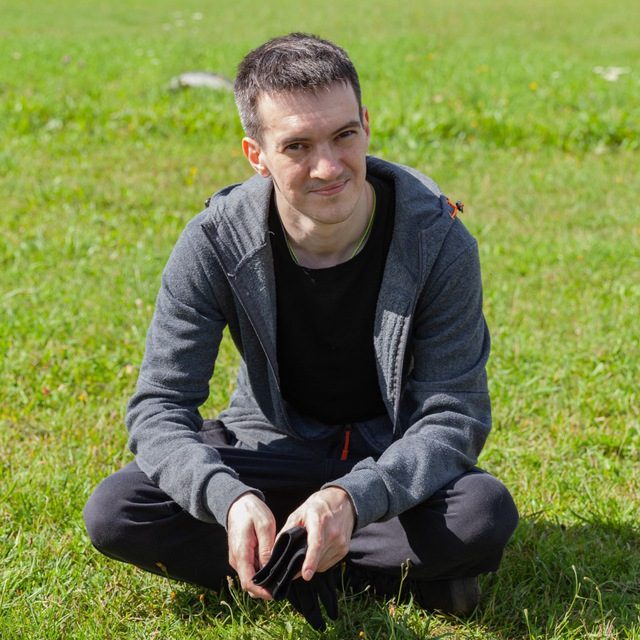

# О себе

Ведущий инженер технолог на производстве электроники.
 Заинтересовался ***DataScience***, прошел курс в Нето и решил применить полученные знания в жизни, но понял что не хватает знание в программировани для написания полноценного приложения и пошел на курс *[Python разработчик](https://netology.ru/programs/python-basic)*. 

 [Сертификат о окончании курса DataScience](assets/certificate.pdf)
## Идея:
### Полноценное приложение для рентгена
Приложение которое с использованием нейросети будет выполнять анализ рентгеновский изовбражений на качество пайки и давать подсказку оператору.
### Этапы развития проекта:
1) сбор датасета ✅
2) обучение нейронки ✅
3) написание "скриншотера" ✅
4) связь скриншотера с нейронкой ⏳
5) написание UI для удобного пользования 📚

Контакты:

